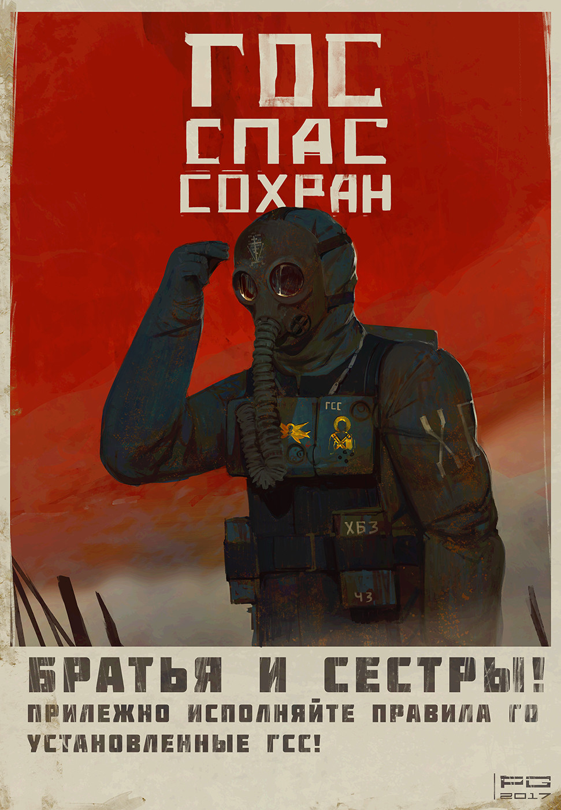

# Страничка о себе
---
## Фамилия: Мишин
## Имя: Станислав
## Отчество: Александрович
### Родился: В понедельник
### Крестился: Во вторник
### Женился: В среду 
---
## *Любимая цитата* *:*

> #### *Я видел нечто, во что вы, люди, просто не поверите. Горящие боевые корабли на подступах к Ориону. Я видел Си-лучи... мерцающие во тьме близ врат Тангейзера. И все эти мгновения исчезнут во времени, как слёзы под дождём. Пора умирать.*
---

# *~~Личное~~  фото* *:*

---
## Адрес проживания :  [ ~~Данные удалены~~ ]
## Марка машины :  [ ~~Данные удалены~~ ]
## Домашний питомец :  [ ~~Данные удалены~~ ]
## Любимые книги: 
 ### 1. Завтра война. Автор:  Александр Зорич
 ### 2. Сказания Меекханского пограничья. Автор: Роберт М. Вегнер
## Трудоустройство: Где-то в IT
